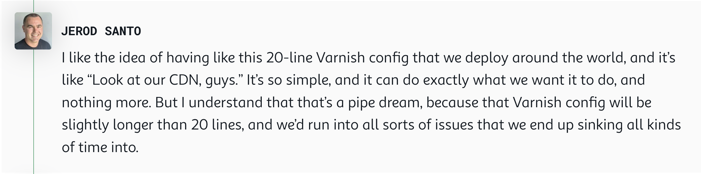

# Pipely™️ - single-purpose, single-tenant CDN

Based on [Varnish Cache](https://varnish-cache.org/releases/index.html) (OSS FTW 💚). This started as the simplest CDN running on [fly.io](https://fly.io/changelog).
for [changelog.com](https://changelog.com)

You are welcome to fork and build this your own.

## How it started



> 🧢 Jerod Santo - March 29, 2024 - <a href="https://changelog.com/friends/38#transcript-208" target="_blank">Changelog & Friends #38</a>

## How is it going (a.k.a. Roadmap)

- ✅ Static backend, 1 day stale, stale on error, `x`-headers - [Initial commit](https://github.com/thechangelog/pipely/commit/17d3899a52d9dc887efd7f49de92b24249431234)
- ✅ Dynamic backend, `cache-status` header - [PR #1](https://github.com/thechangelog/pipely/pull/1)
- ✅ Add tests - [PR #3](https://github.com/thechangelog/pipely/pull/3)
- ✅ Make it easy to develop locally - [PR #7](https://github.com/thechangelog/pipely/pull/7)
- ✅ Add support for TLS backends, publish & deploy to production - [PR #8](https://github.com/thechangelog/pipely/pull/8)
- ✅ Add Feeds backend - [PR #10](https://github.com/thechangelog/pipely/pull/10)
- ✅ Add Assets backend - [PR #11](https://github.com/thechangelog/pipely/pull/11)
- ✅ Send Varnish logs to Honeycomb.io - [PR #12](https://github.com/thechangelog/pipely/pull/12)
- ✅ Enrich Varnish logs with GeoIP data- [PR #13](https://github.com/thechangelog/pipely/pull/13)
- ☑️ Ensure that processes which crash are automatically restarted
- ☑️ Send logs to S3
- ☑️ Add redirects from [Fastly VCL](./varnish/changelog.com.vcl)
- ☑️ Implement purge across all app instances (Fly.io machines)

## Local development and testing

While it's fun watching other people experiment with digital resin (varnish
😂), it's a whole lot more fun when you can repeat those experiments yourself,
understand more how it works, and make your own modifications.

You can find some instructions and notes for kicking the tires and [developing
& testing this locally](docs/local_dev.md).

A few other commands that you may be interested in:

```bash
# Requires https://github.com/casey/just
just
Available recipes:
    debug                      # Debug container image interactively
    how-many-lines             # How many lines of Varnish config?
    how-many-lines-raw         # How many lines of Varnish config?
    http-profile url="https://pipedream.changelog.com/" # Observe all HTTP timings - https://blog.cloudflare.com/a-question-of-timing
    shell                      # Open an interactive shell for high-level commands, e.g. `test`, `debug | terminal`, etc.
    test                       # Test everything
    test-acceptance-cdn *ARGS  # Test remote CDN
    test-acceptance-cdn2 *ARGS # Test remote CDN2 (a.k.a. Pipely, a.k.a. Pipedream)
    test-acceptance-local      # Test local CDN
    test-reports               # Open test reports
    test-reports-rm            # Clear test reports
    test-vtc                   # Test VCL config

    [team]
    cert fqdn                  # Add cert $fqdn to app
    certs                      # Show app certs
    deploy tag="dev-$USER"     # Deploy container image
    envrc-secrets              # Create .envrc.secrets with credentials from 1Password
    ips                        # Show app IPs
    machines                   # Show app machines
    publish tag="dev-$USER"    # Publish container image
    restart                    # Restart ALL app machines, one-by-one
    scale                      # Scale production app
    status                     # Show app status

# Run the tests
just test
```

## How can you help

If you have any ideas on how to improve this, please open an issue or go
straight for a pull request. We make this as easy as possible:
- All commits emphasize [good commit messages](https://cbea.ms/git-commit/) (more text for humans)
- This repository is kept small & simple (single purpose: build the simplest CDN on Fly.io)
- Slow & thoughtful approach - join our journey via [audio with transcripts](https://changelog.com/topic/kaizen) or [written](https://github.com/thechangelog/changelog.com/discussions/categories/kaizen)

See you in our [Zulip Chat](https://changelog.zulipchat.com/) 👋

> [!NOTE]
> Join from <https://changelog.com/~> . It requires signing up and requesting an invite before you can **Log in**


## Contributors

- [Gerhard Lazu](https://gerhard.io)
- [James A Rosen](https://www.jamesarosen.com/now)
- [Matt Johnson](https://github.com/mttjohnson)
- [Nabeel Sulieman](https://github.com/nabsul)
