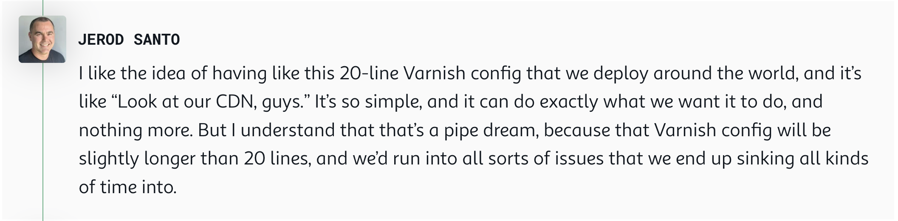

# Pipely™️ - single-purpose, single-tenant CDN

Based on [Varnish Cache](https://varnish-cache.org/releases/index.html) (OSS FTW 💚). This started as the simplest CDN running on [fly.io](https://fly.io/changelog)
for [changelog.com](https://changelog.com)

You are welcome to fork and build this your own.

## How it started



> 🧢 Jerod Santo - March 29, 2024 - <a href="https://changelog.com/friends/38#transcript-208" target="_blank">Changelog & Friends #38</a>

## How is it going - a.k.a. The Roadmap to `v1.0`

- ✅ Static backend, 1 day stale, stale on error, `x`-headers - [Initial commit](https://github.com/thechangelog/pipely/commit/17d3899a52d9dc887efd7f49de92b24249431234)
- ✅ Dynamic backend, `cache-status` header - [PR #1](https://github.com/thechangelog/pipely/pull/1)
- ✅ Add tests - [PR #3](https://github.com/thechangelog/pipely/pull/3)
- ✅ Make it easy to develop locally - [PR #7](https://github.com/thechangelog/pipely/pull/7)
- ✅ Add support for TLS backends, publish & deploy to production - [PR #8](https://github.com/thechangelog/pipely/pull/8)
- ✅ Add Feeds backend - [PR #10](https://github.com/thechangelog/pipely/pull/10)
- ✅ Add Assets backend - [PR #11](https://github.com/thechangelog/pipely/pull/11)
- ✅ Send Varnish logs to Honeycomb.io - [PR #12](https://github.com/thechangelog/pipely/pull/12)
- ✅ Enrich Varnish logs with GeoIP data - [PR #13](https://github.com/thechangelog/pipely/pull/13)
- ✅ Supervisor restarts crashed processes - [PR #14](https://github.com/thechangelog/pipely/pull/14)
- ✅ Auth `PURGE` requests - [PR #16](https://github.com/thechangelog/pipely/pull/16)
- ☑️ Send logs to S3
- ☑️ Add redirects from [Fastly VCL](./varnish/changelog.com.vcl)
- ☑️ All contributors review & clean-up
  - `just bench-feed-*`
  - Is the VCL as clean & efficient as it could be?
  - Does everything work as expected?
  - Anything that can be removed?
  - How do we make this friendlier to new users?
  - What would make this more contribution-friendly?
  - How easy is this to use as your own deployment?
- ☑️ Tag & ship `v1.0-rc.1`
- ☑️ Route 10% of production traffic through `v1.0-rc.1`
- ☑️ Tag & ship `v1.0-rc.2` (component updates, etc.)
- ☑️ Route 33% of production traffic through `v1.0-rc.2` (observe cold cache behaviour, etc.)
- ☑️ Tag & ship `v1.0-rc.3` (component updates, etc.)
- ☑️ Route 80% of production traffic through `v1.0-rc.3` (last chance to kick the tyres before `1.0`)
- ☑️ Tag & ship `v1.0`
- ☑️ Route 100% of production traffic through `v1.0`

## Local development and testing

### Prerequisites

- Docker or equivalent
- Just version 1.27.0 or higher

And that's about it. Everything else is containerized with Dagger.

For Windows Developers:

- You will need to have the Windows Subsystem for Linux (WSL).
- If you want to run `just` commands from PowerShell, you will need to install `just` both in Windows and the Linux system. You'll want to make sure that `just --version` and `bash -uc "just --version"` both work from PowerShell.

While it's fun watching other people experiment with digital resin (varnish
😂), it's a whole lot more fun when you can repeat those experiments yourself,
understand more how it works, and make your own modifications.

Use 🤖 [`just`](https://github.com/casey/just?tab=readme-ov-file#installation) `v1.27.0` or newer as the starting point:

```bash
just
Available recipes:
    how-many-lines                  # How many lines of Varnish config?
    how-many-lines-raw              # How many lines of Varnish config?
    http-profile url="https://pipedream.changelog.com/" # Observe all HTTP timings - https://blog.cloudflare.com/a-question-of-timing
    local-debug                     # Debug container locally
    local-run                       # Run container locally: available on http://localhost:9000
    test                            # Test VTC + acceptance locally
    test-acceptance-fastly *ARGS    # Test CURRENT production
    test-acceptance-local           # Test local setup
    test-reports                    # Open test reports
    test-reports-rm                 # Clear test reports
    test-vtc                        # Test VCL config

    [team]
    cert fqdn                       # Add cert $fqdn to app
    certs                           # Show app certs
    deploy tag=_DEFAULT_TAG         # Deploy container image
    envrc-secrets                   # Create .envrc.secrets with credentials from 1Password
    ips                             # Show app IPs
    local-production-debug          # Debug production container locally - assumes envrc-secrets has already run
    local-production-run            # Run production container locally - assumes envrc-secrets has already run - available on http://localhost:9000
    machines                        # Show app machines
    publish tag=_DEFAULT_TAG        # Publish container image - assumes envrc-secrets was already run
    restart                         # Restart ALL app machines, one-by-one
    scale                           # Scale production app
    secrets                         # Set app secrets - assumes envrc-secrets was already run
    status                          # Show app status
    tag tag sha discussion          # Tag a new release
    test-acceptance-pipedream *ARGS # Test NEW production - Pipedream, the Changelog variant of Pipely

# Run the tests
just test
```

The only other pre-requisite for the commands that run services locally is 🐳 [Docker](https://docs.docker.com/engine/install/)

## How can you help

If you have any ideas on how to improve this, please open an issue or go
straight for a pull request. We make this as easy as possible:
- All commits emphasize [good commit messages](https://cbea.ms/git-commit/) (more text for humans)
- This repository is kept small & simple (single purpose: build the simplest CDN on Fly.io)
- Slow & thoughtful approach - join our journey via [audio with transcripts](https://changelog.com/topic/kaizen) or [written](https://github.com/thechangelog/changelog.com/discussions/categories/kaizen)

See you in our [Zulip Chat](https://changelog.zulipchat.com/) 👋

> [!NOTE]
> Join from <https://changelog.com/~> . It requires signing up and requesting an invite before you can **Log in**


## Contributors

- [Gerhard Lazu](https://gerhard.io)
- [James A Rosen](https://www.jamesarosen.com/now)
- [Matt Johnson](https://github.com/mttjohnson)
- [Nabeel Sulieman](https://github.com/nabsul)
